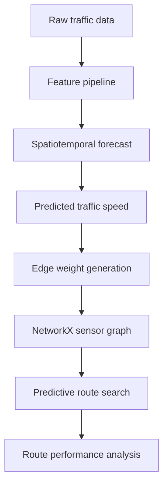
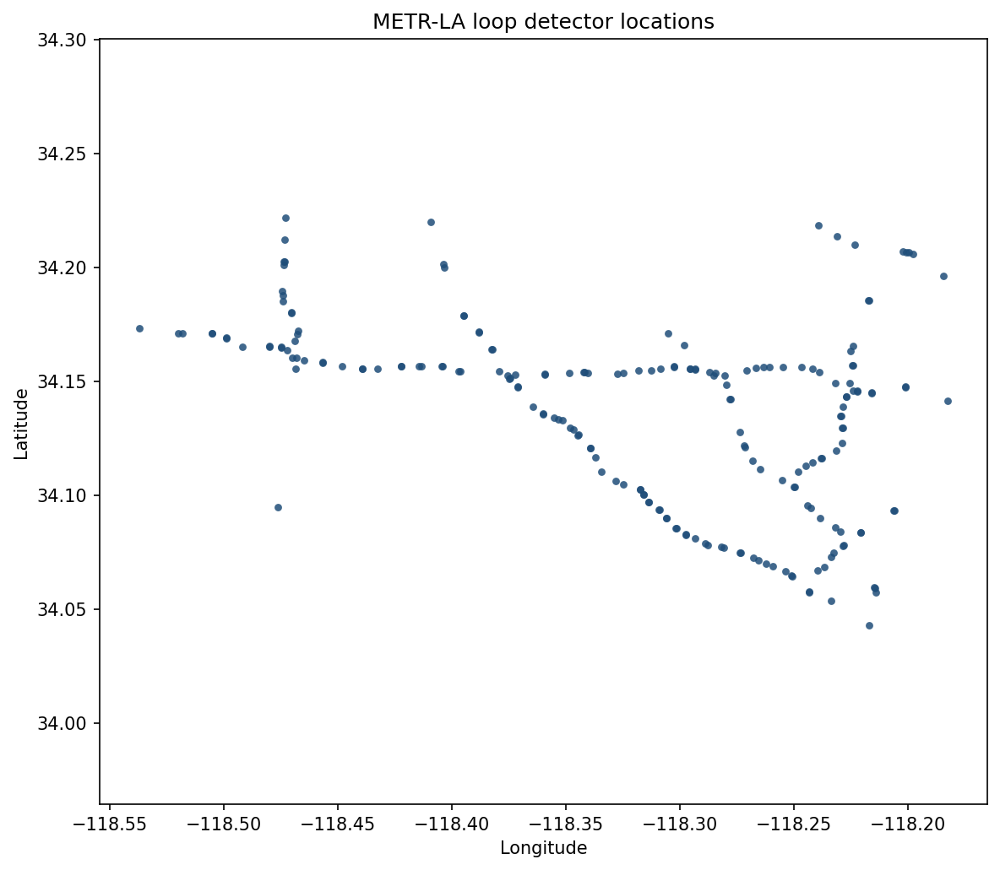
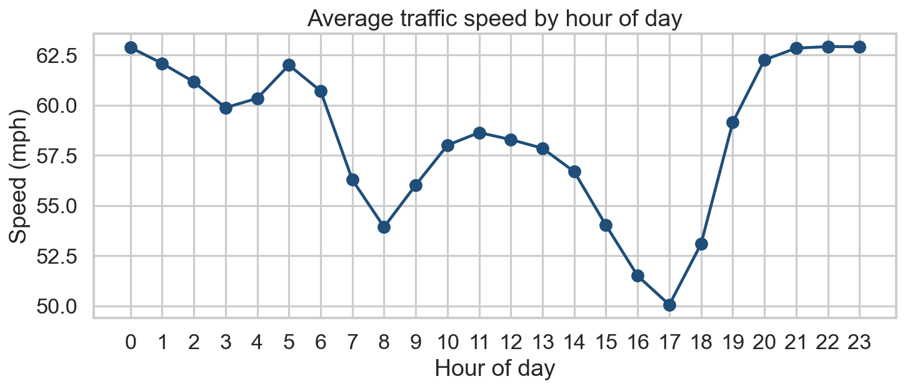

# TrafficFlow

TrafficFlow is an end-to-end spatiotemporal machine learning and network optimization system that forecasts future traffic conditions and uses those predictions to make routing decisions. The project compares traditional routing methods with prediction-aware routing to test whether better traffic forecasts produce measurable travel-time savings.

This is an applied research-style pipeline, not a single tutorial notebook. Forecasting is treated as an upstream component of an operational decision: choosing a route on a transportation network.

```text
Traffic Data → Forecasting → Predicted Edge Costs → Routing → Realized Travel Time
```

## Research question

Can spatial relationships between roadway sensors improve future traffic predictions, and can those predictions improve routing decisions compared with static or non-predictive routing?

The evaluation connects three layers:

**spatial information → forecasting accuracy → route quality**

Routes are scored on **realized future traffic**, not on the travel time a model predicted for itself.

## Pipeline

```text
Raw Traffic Data
        ↓
Data Validation
        ↓
Data Cleaning
        ↓
Exploratory Data Analysis
        ↓
Temporal Feature Engineering
        ↓
Spatial / Graph Construction
        ↓
Forecasting Dataset Creation
        ↓
Baseline Forecasting Models
        ↓
Spatially-Aware Forecasting Models
        ↓
Model Evaluation
        ↓
Future Traffic Predictions
        ↓
Predicted Road / Edge Travel Costs
        ↓
Network Graph
        ↓
Routing / Optimization
        ↓
Static vs Current vs Predictive Route Comparison
        ↓
Visualization and Statistical Analysis
```



Forecasting models are swappable. The routing layer consumes predicted speeds through a documented speed-to-travel-time transform and does not depend on a specific estimator.

## Dataset

The implementation uses **METR-LA** (Li et al., [DCRNN, ICLR 2018](https://arxiv.org/abs/1707.01926)). Figures below are from `scripts/inspect_data.py` on the downloaded files.

| Property | Observed |
| --- | --- |
| Sensors | 207 |
| Timestamps | 34,272 |
| Sampling | 5 minutes (regular; no missing timestamps) |
| Period | 2012-03-01 00:00:00 → 2012-06-27 23:55:00 |
| Target | Speed (mph) |
| Missing | 8.1094%, stored as zeros (0 pandas NA) |
| Valid-speed mean / P01 / P99 | 58.46 / 13.13 / 69.75 mph |

Literature often cites an end date of 30 June 2012. The HDF5 file **ends 27 June 23:55**. Sensor count, timestep count, frequency, and missingness match the usual references.

Raw files live in `data/raw/` and are never overwritten. Details, units, and graph caveats: [docs/dataset.md](docs/dataset.md). Quality report: `outputs/metrics/data_quality.md`.

## Exploratory patterns

Computed on cleaned speeds (short gaps interpolated; long outages left missing):

- **Hour of day:** fastest overnight (~63 mph at 22:00); morning slowdown at 08:00 (53.9 mph); slowest at 17:00 (50.1 mph).
- **Weekday:** weekdays average 57.2 mph; weekends 61.7 mph (Sunday 63.1 mph).
- **Missingness:** 2,148 timestamps are 100% missing. Highest sensor missing rates exceed 20%.





## Sensor graph

Built from DCRNN pairwise road-network distances restricted to the 207 METR-LA sensors:

| Property | Observed |
| --- | --- |
| Nodes | 207 |
| Directed edges | 11,546 |
| Isolated nodes | 0 |
| Weakly connected | yes |
| Strongly connected | no (206-node component + sensor `717804`) |

Edges are detector relationships, not a complete street map. Origin-destination routing will be sampled inside the 206-node strongly connected component.

## Baseline forecasting (test set)

Chronological split (no shuffle):

- Train: 2012-03-01 00:00 → 2012-05-23 07:05 (23,990 steps)
- Validation: 2012-05-23 07:10 → 2012-06-10 03:25 (5,140)
- Test: 2012-06-10 03:30 → 2012-06-27 23:55 (5,142)

| Model | 5 min MAE | 15 min MAE | 30 min MAE | 60 min MAE |
| --- | ---: | ---: | ---: | ---: |
| Persistence | **2.667** | **3.345** | **4.045** | 5.202 |
| Historical (sensor + weekday + hour, train only) | 4.298 | 4.298 | 4.298 | **4.298** |

Units: mph. Persistence wins at short horizons, as expected from strong lag-1 autocorrelation. The seasonal mean is horizon-independent and overtakes persistence at 60 minutes. Learned models must beat these numbers on the same split. Source: `outputs/metrics/baseline_forecast_metrics.csv`.

## Methods (remaining)

1. Temporal-only gradient boosting (XGBoost)
2. The same model with neighbor / graph features
3. Predicted speed → edge travel time (mph and miles → minutes)
4. Dijkstra routing on NetworkX
5. Static vs current-state vs predictive routes, scored on realized future traffic
6. Optional later: time-dependent routing, hindsight oracle, Streamlit, GNN

## Installation

Python 3.10+ is required.

```bash
python -m venv .venv
# Windows
.venv\Scripts\activate
# macOS / Linux
# source .venv/bin/activate

python -m pip install --upgrade pip
python -m pip install -e ".[dev]"
```

Alternatively:

```bash
python -m pip install -r requirements.txt
python -m pip install -e .
```

On some Windows Python installs, `requests` TLS verification fails. `scripts/download_data.py` retries those downloads with `curl`, which uses the system certificate store.

## Usage

```bash
python scripts/download_data.py
python scripts/inspect_data.py
python scripts/prepare_data.py
python scripts/build_graph.py
python scripts/generate_eda_figures.py
python scripts/train_baseline.py
pytest
```

Reusable logic lives in `src/trafficflow/`. Notebooks under `notebooks/` are for exploration only.

## Project structure

```text
configs/                 YAML for data, models, and routing
data/raw|interim|processed|external
docs/                    Dataset notes
scripts/                 Pipeline entry points
src/trafficflow/         Installable package
  data/                  Load, validate, clean, quality report
  features/              Temporal features and graph construction
  models/                Baselines and metrics
  routing/               (next)
  visualization/
  utils/
tests/
outputs/figures|metrics  Generated plots and tables
```

## Development phases

| Phase | Status | Focus |
| --- | --- | --- |
| 0 | Done | Repository scaffold, config, logging, tests |
| 1 | Done | Reproducible METR-LA download and loading |
| 2 | Done | Data quality report and cleaning |
| 3 | Partial | EDA figures (hour, weekday, map, missingness) |
| 4 | Done | Sensor graph construction and validation |
| 5 | Partial | Temporal helpers and chronological split |
| 6 | Partial | Persistence and historical-mean baselines |
| 7–9 | Next | Temporal XGBoost vs spatial XGBoost |
| 10–13 | Planned | Routing engine and historical simulation |
| 14–16 | Optional | GNN, Streamlit, final documentation |

## Limitations

- The sensor graph is not a complete street map.
- One detector (`717804`) is outside the strongly connected component.
- METR-LA is freeway loop-detector traffic, not an urban arterial network.
- 5.28% of cells remain missing after short-gap interpolation (long outages).
- Routing simulation will not model congestion feedback from the routed vehicles.
- Accidents, weather, and closures are not in the base dataset.
- Learned forecasting and predictive routing are not in this README yet.

## License

MIT. METR-LA remains subject to the terms of its original distributors. Cite Li et al. (ICLR 2018) if you use the data.
